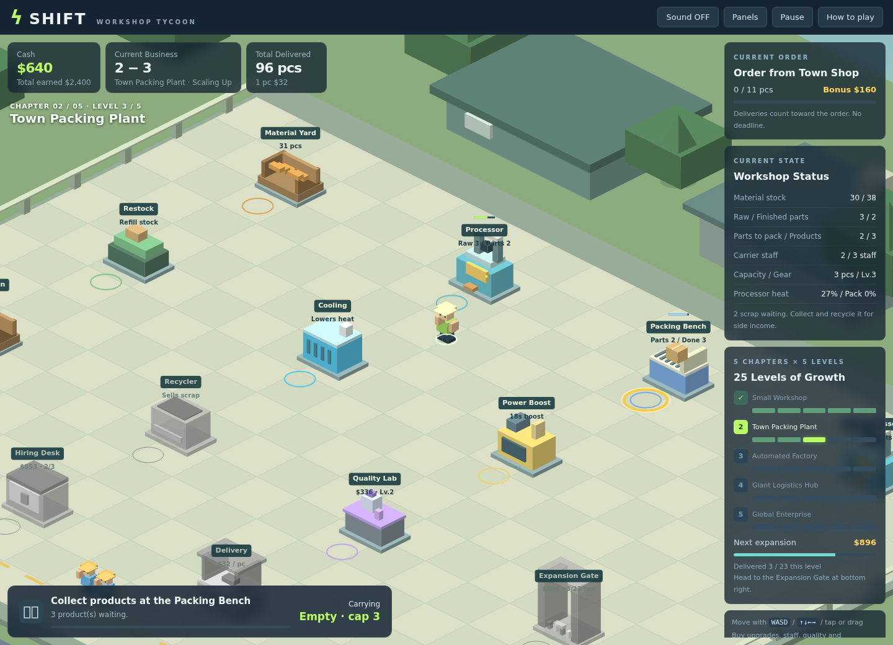

# SHIFT — Workshop Tycoon

A small isometric factory-growth game that runs in the browser. Walk the floor, carry materials through processing, packing and delivery, and grow a tiny workshop into a global enterprise.

**Play it:** https://reki2000.github.io/demos-worker/



## How to play

- Tap a machine or the floor and your character walks there, avoiding obstacles. You can also drag, or use WASD / arrow keys.
- Carry goods **Material Yard → Processor → Packing Bench → Delivery**. Standing on a machine's ring collects, loads or picks up automatically. After unloading at the Processor or Packing Bench you won't pick up output on the same visit, so you can feed in as much as you like; step off and back on to collect.
- Standing 1.3 seconds on the ring of the Gear Bench, Hiring Desk, Quality Lab or Expansion Gate buys an upgrade. Leave the ring before buying again.
- Expanding needs both enough deliveries and enough cash. There are 5 chapters × 5 levels each.
- Keep things running: restock materials, cool overheating machines, clean puddles, recycle scrap, chain deliveries, and fill regular and rush orders.
- Chapter 2 adds a 2nd Processor, chapter 3 a Paint Booth, chapter 4 a parts conveyor, and chapter 5 an Export Truck.

Progress is saved in your browser (localStorage). No purchases, no ads, no external libraries.

## Project layout

| File | Purpose |
| --- | --- |
| `index.html` | Page layout, CSS and help text |
| `engine.js` | Movement, economy, progression, rendering and saving |
| `build.cjs` | Inlines `engine.js` into a single `SHIFT-game.html` |
| `verify*.cjs`, `balance.cjs` | Gameplay, layout, rendering and balance checks |

## Development

Requires Node.js 18+.

```sh
npm run build          # generate SHIFT-game.html (no dependencies needed)
npm install            # only needed for the tests (skia-canvas)
npm test               # gameplay, layout and tap-navigation checks
npm run test:balance   # per-chapter production and revenue check
```

To work on the source, open `index.html` directly; it loads `engine.js` from the same folder.

## Deployment

A GitHub Actions workflow (`.github/workflows/pages.yml`) builds the single-file game on every push to `main` and publishes it to GitHub Pages.
